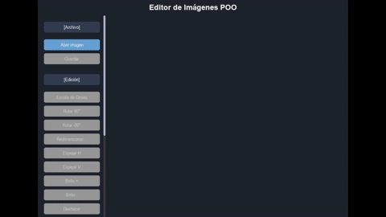
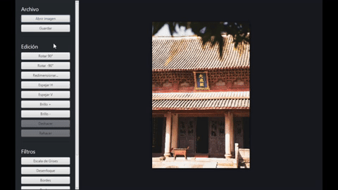

# Proyecto General: Colección de Editores de Imágenes

Este repositorio contiene múltiples implementaciones de editores de imágenes, cada uno desarrollado en diferentes lenguajes de programación y con enfoques variados. El objetivo es demostrar principios de diseño modular y programación orientada a objetos (POO).

## Editores Incluidos

### 1. CppImageEdit
- **Lenguaje**: C++
- **Descripción**: Editor de imágenes modular por consola.
- **Características**:
  - Filtros: escala de grises, inversión, brillo, binarización, sepia.
  - Carga y guarda imágenes en formatos PNG, JPG, BMP, TGA.
  - Arquitectura orientada a objetos.
  - > No cuenta con interfaz gráfica
- **Ubicación**: `CppImageEdit/`

### 2. PyImageEdit
- **Lenguaje**: Python
- **Descripción**: Editor de imágenes con interfaz gráfica usando Pygame.
- **Características**:
  - Interfaz gráfica adaptable con menú lateral scrollable.
  - Filtros: desenfoque, bordes, realzar, sepia, invertir, binarizar, etc.
  - Botones inteligentes: habilitados según el estado de la imagen.
- **Ubicación**: `PyImageEdit/`

### 3. JavaImageEdit
- **Lenguaje**: Java
- **Descripción**: Editor de imágenes con interfaz gráfica usando Swing.
- **Características**:
  - Interfaz gráfica intuitiva con menús desplegables.
  - Filtros: escala de grises, inversión, brillo, contraste, sepia, binarización.
  - Soporte para deshacer y rehacer acciones.
- **Ubicación**: `JavaImageEdit/`

## Estructura del Repositorio
```
Proyecto/
├── CppImageEdit/       # Editor en C++
├── PyImageEdit/        # Editor en Python
├── JavaImageEdit/      # Editor en Java
├── README.md           
```

## Requisitos Generales
- **Lenguajes**: C++17 o superior, Python 3.8+, Java 8+
- **Dependencias**:
  - Para C++: stb_image, stb_image_write
  - Para Python: pygame, pillow
  - Para Java: javax.swing, java.awt

## Instalación y Uso

### CppImageEdit
1. Compila el proyecto:
   ```sh
   g++ -Isrc/core -Isrc/filters src/main.cpp src/core/*.cpp src/filters/*.cpp -o imageedit.exe
   ```
2. Ejecuta el programa:
   ```sh
   ./imageedit.exe
   ```

### PyImageEdit
1. Instala las dependencias:
   ```sh
   pip install pygame pillow
   ```
2. Ejecuta el programa:
   ```sh
   python PyImageEdit/main.py
   ```

### JavaImageEdit
1. Asegúrate de tener el JDK instalado.
2. Compila el proyecto:
   ```sh
   javac -d bin -sourcepath src src/JavaImageEdit/*.java
   ```
3. Ejecuta el programa:
   ```sh
   java -cp bin JavaImageEdit.Main
   ```

## Capturas de Pantalla y GIFs

### PyImageEdit

*Interfaz gráfica mostrando el menú lateral y una imagen cargada.*

### JavaImageEdit

*Interfaz gráfica con menús desplegables y una imagen cargada.*

### CppImageEdit

*Menú interactivo por consola mostrando opciones de filtros.*

## Ejemplos de Uso

### CppImageEdit
1. Cargar una imagen:
   ```sh
   ./imageedit.exe
   ```
   Selecciona la opción `1` y proporciona la ruta de la imagen.

2. Aplicar un filtro (por ejemplo, escala de grises):
   Selecciona la opción `2`.

3. Guardar la imagen:
   Selecciona la opción `7` y proporciona la ruta de destino.

### PyImageEdit
1. Cargar una imagen:
   Haz clic en `Abrir imagen` en el menú lateral.

2. Aplicar un filtro (por ejemplo, desenfoque):
   Haz clic en `Desenfoque` en el menú lateral.

3. Guardar la imagen:
   Haz clic en `Guardar` en el menú lateral y selecciona la ubicación.

### JavaImageEdit
1. Cargar una imagen:
   Ve al menú `Archivo > Abrir` y selecciona una imagen.

2. Aplicar un filtro (por ejemplo, sepia):
   Ve al menú `Filtros > Sepia`.

3. Guardar la imagen:
   Ve al menú `Archivo > Guardar como` y selecciona la ubicación.
